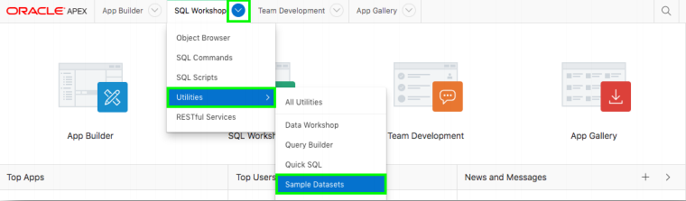

# 演習１: RESTエンドポイントの構築 - サンプル表の作成し、RESTを有効化します。

この演習では、最初に使用するサンプル・データセットを作成し、データをインポートした後、RESTエンドポイントを作成します。作成したRESTエンドポイントを検証します。作成されたRESTエンドポイントのURLは、その後のWebソース・モジュールの作成に使用されます。
### **パート１**: 1番目のワークスペースにEMP表とDEPT表を作成します。

1. 1番目のワークスペースにログインします。
2. メイン・メニューから、**SQL Workshop**を選択し、その後、**Utilities**を選び、最後に**Sample Datasets**をクリックします。

    

3. EMP / DEPT の行にある、**Install**をクリックします。  
    
4. **Next**をクリックし、**Install Dataset**をクリックします。そして**Exit**をクリックします。  
    *ここではインストールした表からアプリケーションの作成は行いません。*

### **パート２**: 表のREST操作を有効にします。

1. メイン・メニューから**SQL Workshop**を選びます。そして**SQL Scripts**をクリックします。  
    
2. **Create**をクリックします。  
    
3. 新しくブラウザのウィンドウにて、以下のURLを開きます:
http://www.oracle.com/technetwork/developer-tools/apex/application-express/apex-hol-rest-enable-5478504.txt

4. スクリプト・エディタにて:
    - Script Nameとして次を入力します。**Manual REST on EMP and DEPT**
    - 先ほど開いたファイルの内容を、スクリプト・エディタの本文としてコピペします。
    - **Run**をクリックします。

    
    - **Run Now**をクリックします。
    *４行に実行が成功したというメッセージが結果として表示されます。*

    

### **パート３**: RESTサービスを検証します。

1. メイン・メニューから、 **SQL Workshop**をクリックして、そして**RESTful Services**をクリックします。
2. **Modules**を開きます; **emp.rest**を開きます; **hol/**を開いて、**GET**をクリックします。
    
3. Full URLをクリップボードにコピーします。
4. ブラウザにて新しくタブまたはウィンドウを開いて、先ほどコピーしたFull URLを貼り付けます。

    

## 参考情報

パート２にて実行しているSQLスクリプトは、スキーマのREST対応を有効化と、EMP表とDEPT表それとEMP_DEPT_VビューのRESTモジュールと必要なハンドラの作成を行います。

これら処理が画面からも実施することができます。最初にSQL Workshop > RESTful Servicesを開いて、スキーマのRESTサービスを有効化します。その後、SQL Workshop > Object Browserを開いて、それぞれの表、ビューをクリックして、RESTタブを開き、RESTサービスを有効化します。この方法で作成されたRESTハンドラは、サービスが呼び出される度に、毎回データ・ディクショナリを参照します。そのため、パート２で個別に作成したハンドラより効率が落ちることになります。特にapex.oracle.comのように、20,000以上のスキーマがあり、データ・ディクショナリが非常に大きい場合は、それが顕著に現れます。

## まとめ

これで演習１は完了です。この演習では、１番目のワークスペースに、EMPとDEPT表を作成し、この後の演習にてデータを表示するために使用するRESTエンドポイントを作成しました。
[ここをクリックして演習２へ進みます](2-building-your-app-which-will-be-based-on-the-rest-endpoints-creating-the-app.md)