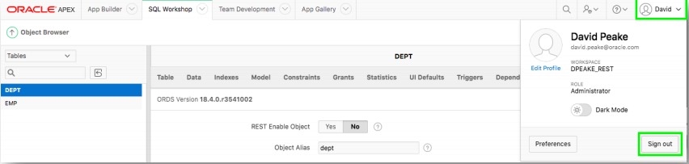
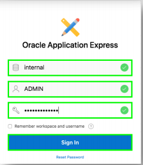
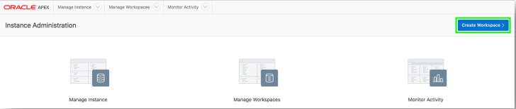
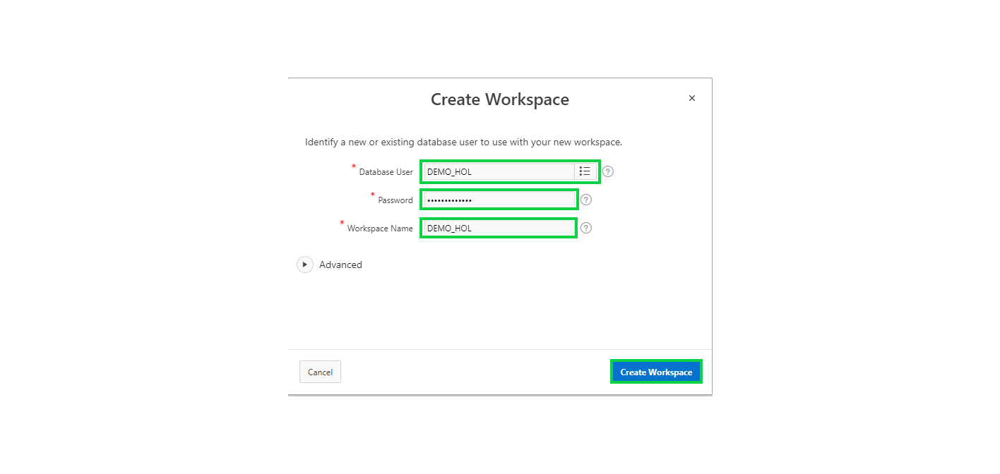
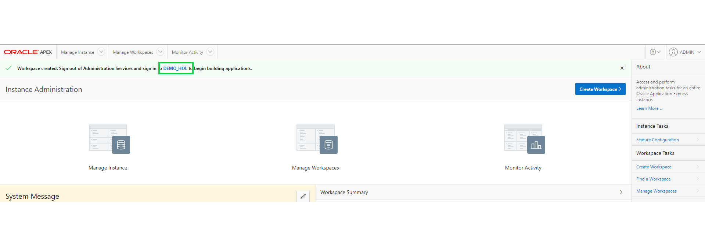
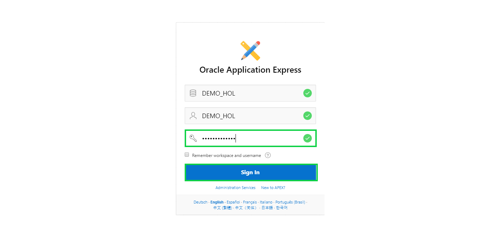
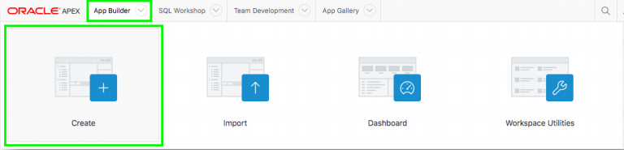
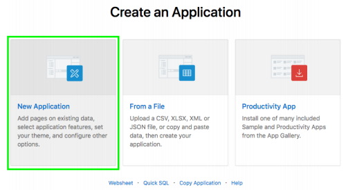
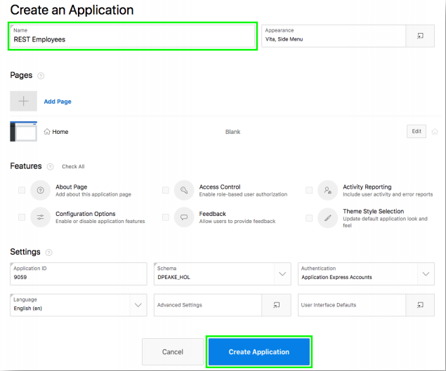

# 演習２: RESTエンドポイントを使うアプリケーションを作成します。 - アプリケーションの作成

この演習では、２番目のワークスペースにログインし、アプリケーションを作成します。
### **パート１**: 2番目のワークスペースの作成し、ログインします。

1. 最上部のツールバーの右端にある、ユーザー名をクリックし、**Sign Out**をクリックします。そして**Return to Sign In Page**をクリックします。
 
    

2. 管理サービスにサインインします。以下の情報を入力して、**Sign In**をクリックします。

    | 設定 | 値 |
    | --- | --- |
    | Workspace | internal |
    | Username | ADMIN |
    | Password | **`Secretpassw0rd`** |

    

3. **Create Workspace**をクリックします。

    

4. 以下の情報を入力し、**Create Workspace**をクリックします。

    | 設定 | 値 |
    | --- | --- |
    | Database User | DEMO_HOL |
    | Password | **`SecretPassw0rd`** |
    | Workspace Name | DEMO_HOL |
    
    

5. ワークスペースの作成が成功したことを通知するメッセージに含まれる**DEMO_HOL**のリンクをクリックします。これにより、APEX管理サービスからログアウトし、新規に作成したワークスペースにログインできるようになります。

    

6. パスワードとして、**``SecretPassw0rd``**を入力します。**Remember workspace and username**チェックボックスにチェックをいれて、**Sign In**をクリックします。

    

### **パート２**: アプリケーションを作成します。  

1. **App Builder**をクリックして、**Create**をクリックします。 
    
2. **New Application**をクリックします。 
    
3. Nameとして、**REST Employees**を入力します。
4. **Create Application**をクリックします。

    

## まとめ

これで演習２は完了です。これまでに、EMP表とDEPT表を作成した１番目のワークスペースからログオフし、作成たRESTエンドポイントの検証を終えています。この演習では、２番目のワークスペースを作成し、そこにアプリケーションを新規に作成しました。次の演習では、RESTサービスを呼び出すように、このアプリケーションを拡張します。[ここをクリックして、演習３へ進みます](3-linking-the-rest-service-defined-in-the-first-workspace-adding-a-web-source-for-emp.md)