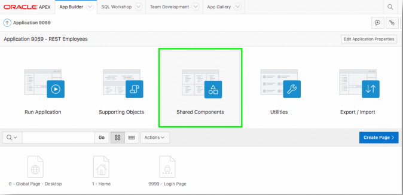
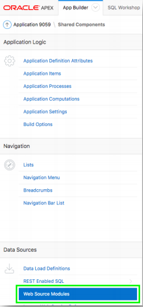
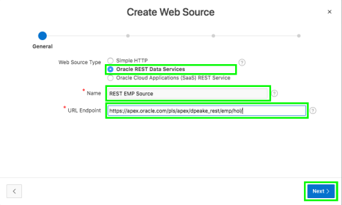
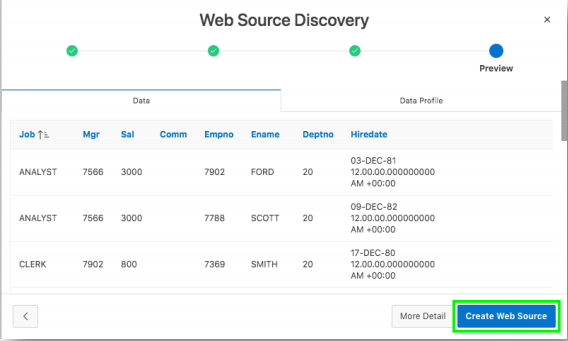
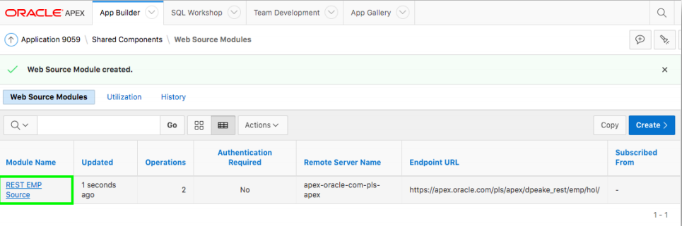
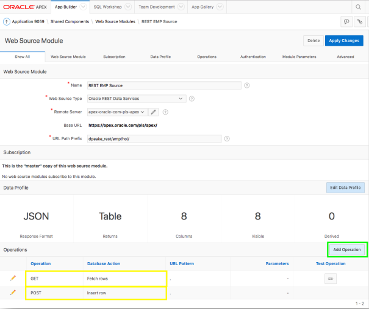
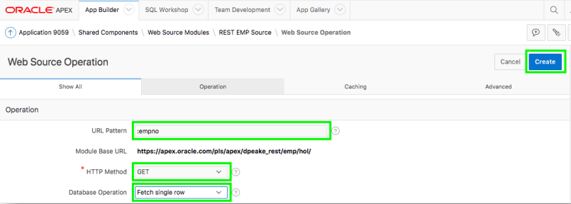
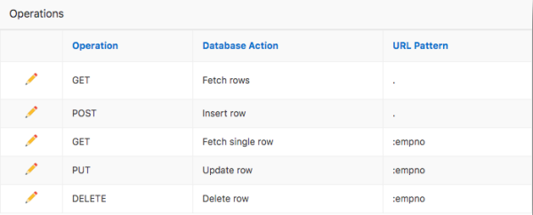

# 演習３: 1番目のワークスペースに定義したRESTサービスと関連づけます。 - EMP表のWebソースの追加

この演習では、１番目のワークスペースに定義したRESTサービスを、前の演習で作成したアプリケーションにWebソースを作成することで紐付けを行います。
### **パート１**: EMP表へWebソースを追加します。

1. **Shared Components**をクリックします。  
    
2. **Data Sources**に含まれる、**Web Source Modules**をクリックします。
    
3. **Create**をクリックした後、**Next**をクリックします。 
    *デフォルト: From Scratch*
5. Web Source Typeとして、**ORACLE REST Data Services**を選択します。
6. Nameとして、**REST EMP Source**を選択します。
7. URL Endpointとして、先ほどテストしたREST URIを入力します。その後、**Next**をクリックします。
    *次のようなURLです。https://<< your service >>/dpeake_rest/emp/hol/*

    

8. Base URLとService URLの指定を確認します。
9. **Next**をクリックします。
10. **Discover**をクリックします。
    *Authentication Required = No*
11. **Create Web Source**をクリックします。

    

### **パート２**: 操作を追加します。

1. **REST EMP Source**をクリックします。

    

2. GETとPOSTの操作のみが登録されていることを確認します。

    

3. **Add Operation**をクリックして、以下を入力します:

    | 設定 | 値入力/選択 | 値 |
    | --- | --- | --- |
    | URL Pattern | 入力 | **:empno** |
    | HTTP Method | 選択 | **GET** |
    | Database Operation | 選択 | **Fetech single row** |
    - Click **Create** 

    

4.  **Add Operation**をクリックして、以下を入力します:

    | 設定 | 値入力/選択 | 値 |
    | --- | --- | --- |
    | URL Pattern | 入力 | **:empno** |
    | HTTP Method | 選択 | **PUT** |
    | Database Operation | 選択 | **Update row** |
    - Click **Create**

5. **Add Operation**をクリックして、以下を入力します:

    | 設定 | 値入力/選択 | Value |
    | --- | --- | --- |
    | URL Pattern | 入力 | **:empno** |
    | HTTP Method | 選択 | **DELETE** |
    | Database Operation | 選択 | **Delete row** |
    - **Create**をクリックします。 
    
    *３つの操作を追加した後には、このように見えるでしょう。*
6. **Apply Changes**をクリックします。
## まとめ

これで演習３は完了です。この演習では、演習１で定義したRESTエンドポイントを、Webソースを作成して紐付けることを学びました。
[ここをクリックして、演習４へ進みます](4-defining-the-report-and-form-on-emp-creating-pages.md)
