# 演習４: EMPにレポートとフォームを定義します。 - ページの作成
この演習では、すでにアプリケーションに作成済みであるWebソースを使って、新しいページを作成します。作成されたページをより良くするための改良も行います。
### **パート１**: Webソースを使ってページを生成します。

1. アプリケーションのホーム・ページに戻ります。
2. **Create Page**をクリックします。

    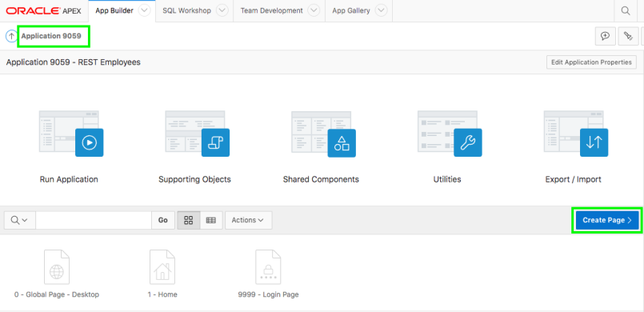

3. Page Typeは, **Report**をクリックします。 
    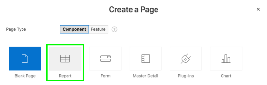
4. Report Typeは、**Report with Form**をクリックします。
    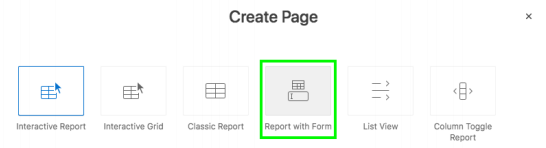
5. 以下を入力して、**Next**をクリックします。
    | 設定 | 値入力/選択 | 値 |
    | --- |--- |--- |
    | Report Page Name | 値入力 | **Employees** |
    | Form Page Name | 選択 | **Maintain Employee** |
    | Form Page Mode | 選択 | **Modal Dialog** |
    | Breadcrumb | 選択 | **Breadcrumb** |
    | Entry Name | 値入力 | **Employees** |

    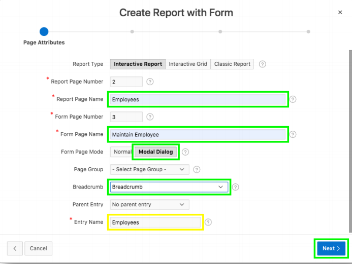

6. Navigation Preferenceとして、**Create a new navigation menu entry**をクリックしたのち、**Next**をクリックします。

    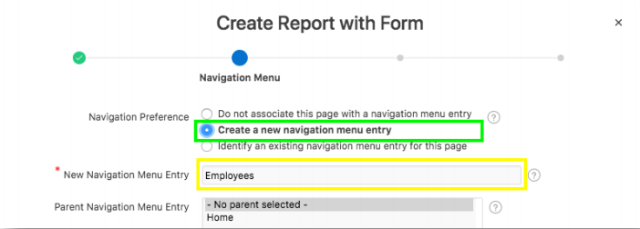
7. データソースとして、**Web Source**をクリックします。
8. Webソース・モジュールとして、**REST EMP Source**を選択して、**Next**をクリックします。

    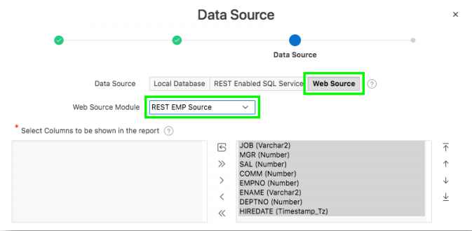
9. Primary Key Columnとして、**EMPNO (Number)**を選択した後、**Create**をクリックします。 

    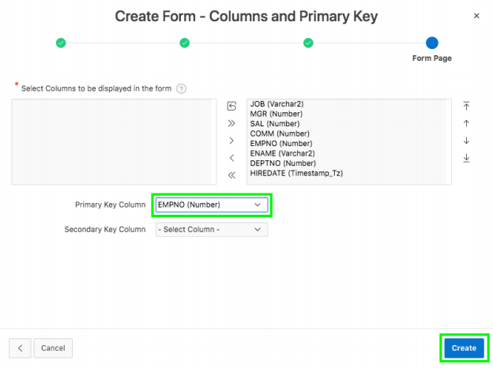

### **パート２**: アプリケーションを実行します。

1. ページ・デザイナから、**Save and Run**をクリックします。  
    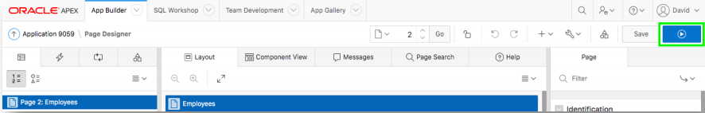

2. ログイン・ページでは、ユーザー認証に必要な情報を入力します。  
    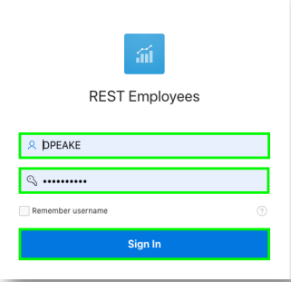

3. 従業員の一覧ページを確認します。

    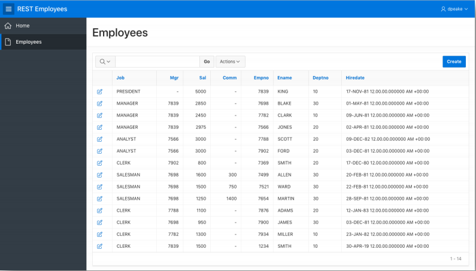

4. 従業員一覧のレポート・ページ上で、**Actions**をクリックした後、**Columns**をクリックします。  
    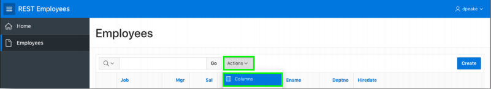
5. **EMPNO**、**ENAME**、**DEPTNO**を最初から３つめまでのカラムに配置します。カラムを選択したのち、矢印を使って移動します。配置の変更を終えたら、**Apply**をクリックします。
    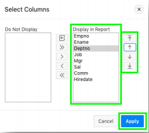

6. **Actions**をクリックし、**Report**を選択した後、**Save Report**をクリックします。 
    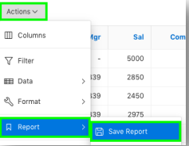

7. Saveとして、**As Default Report Settings**をクリックします。
    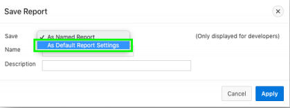
8. **Apply**をクリックします。

    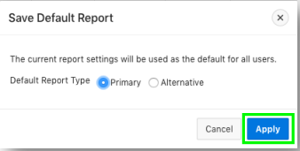
9. 適当な行にある編集アイコンをクリックして、フォーム・ページを開きます。
11. 開発者ツールバーより、**Edit Page 3**をクリックします。 
    
    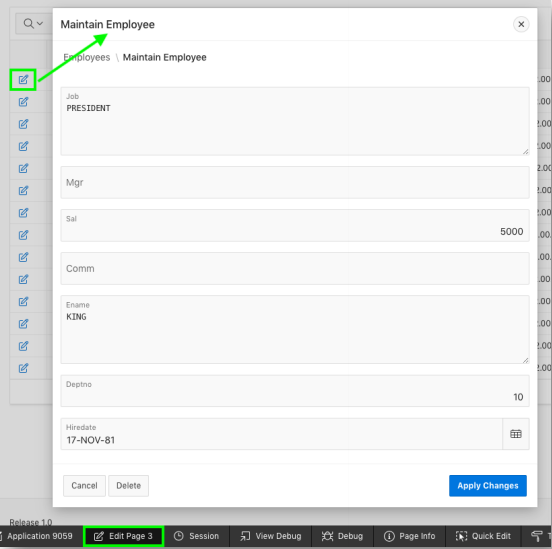 
    - 現在開いているページをを対象として、ページ・デザイナが表示されます。 
    *注意: 開発者ツールバーはアプリケーション・ビルダーからアプリケーションを実行したときにのみ、表示されます。そのため、エンドユーザーが見ることはありません。*

### **パート３**: ページを更新します。

1. レンダリング・タブ(左のペイン)にて、**P3_EMPNO**をクリックします。
    - プロパティ・エディタ(右のペイン)にて:
        - Typeとして**Number Field**を選択します。
        - Labelとして**Empno**を選択します。

    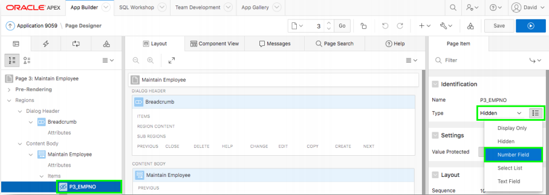
2. レンダリング・タブ(左のペイン)にて、**P3_JOB**をクリックします。
    - プロパティ・エディタ(右のペイン)にて、Typeとして**Text Field**を選択します。
3. レンダリング・タブ(左のペイン)にて、Columnの**P3_ENAME**をクリックします。
    - プロパティ・エディタ(右のペイン)にて、Typeとして**Text Field**を選択します。
4. レンダリング・ツリーにて、**P3_ENAME**を**P3_EMPNO**の直下にドラッグ＆ドロップします。
    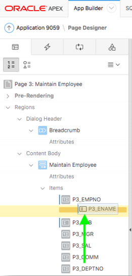
5. レンダリング・タブ(左のペイン)にて、Columnの**P3_DEPTNO**をクリックして選択し、**P3_ENAME**の直下にドラッグ＆ドロップします。
6. レイアウト(真ん中のペイン)にて、**P3_COMM**を選択して、**P3_SAL**の右隣にドラッグ＆ドロップします。
    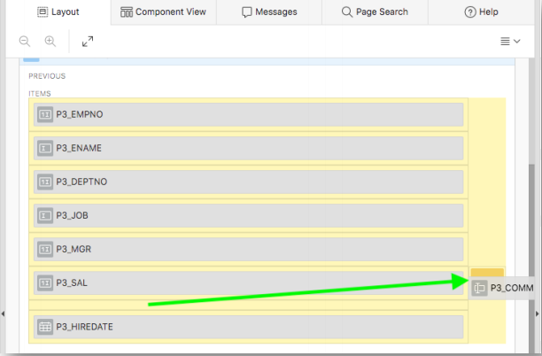
7. ツールバーから、**Save**をクリックします。

### **パート４**: レコードを挿入します。

1. 実行中のアプリケーションの画面に戻り、ブラウザをリフレッシュします。
2. **Create**をクリックして、以下を入力します:

    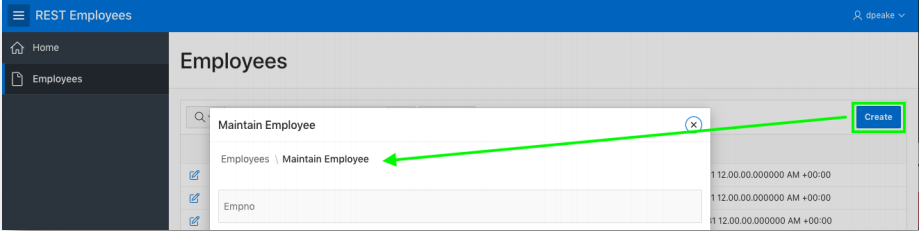

    | 設定 | 値入力/選択 | 値 |
    | --- | --- | --- |
    | Empno | 値入力 | **1234** |
    | Ename | 値入力 | **SMITH** |
    | Deptno | 値入力 | **10** |
    | Jpb | 値入力 | **CLERK** |
    | Mgr | 値入力 | **7839** |
    | Sal | 値入力 | **1500** |
    | Hiredate | 選択 | *any date* |
  
    - **Create**をクリックします。
    *新しく挿入された行を、従業員の一覧ページで確認します。*
    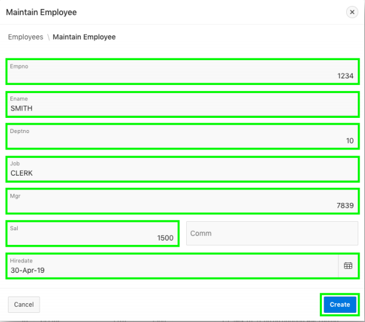

### **パート５**: レコードを更新します。

1. 対話レポートにて、**Ward**を見つけ、編集アイコンをクリックします。そして、以下の値に変更します。

    | 設定 | 値入力/選択 | 値 |
    | --- | --- | --- |
    | Sal | 値入力 | **1500** |
    | Comm | 値入力 | **750** |

    - **Apply Changes**をクリックします。
    - レポートにある、**Ward**の値を確認します。
    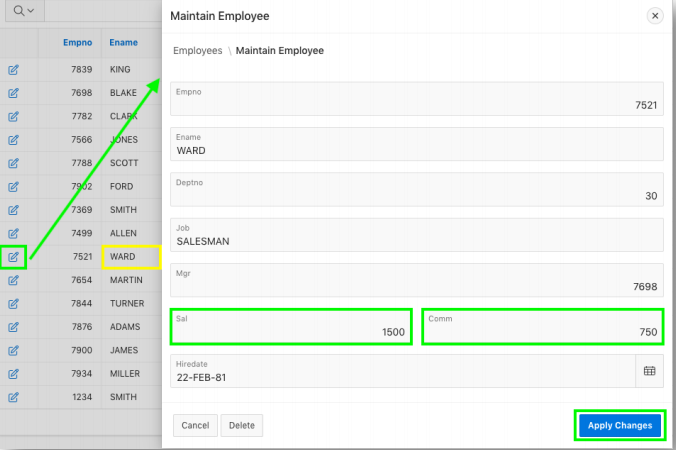

### **パート６**: レコードを削除します。

1. 対話レポートにて、**Turner**を見つけ、編集アイコンをクリックします。
2. **Delete**をクリックした後、**Ok**をクリックします。
    *Turnerが消えていることを、レポートから確認してください。*

    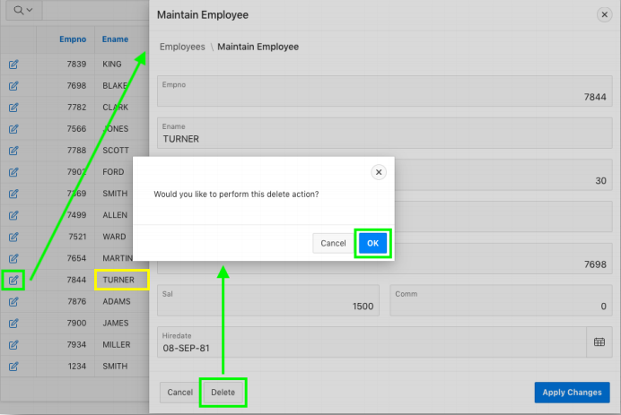

## まとめ

これで演習４の完了です。この演習では、Webソース・モジュールからページを作成する方法と、作成したページをページ・デザイナを使って更新する方法を学びました。また、作成したアプリケーションにてレコードの操作を行いました。[ここをクリックして、演習５へ進みます。](5-using-the-rest-service-on-dept-defining-list-of-values.md)