# 演習５: DEPT表のRESTサービスを使います。 - LOVの定義

この演習では、DEPT表のWebソース・モジュールを作成します。その後、それを使ったLOVを作成し、従業員のページをLOVを使うように変更します。
### 参考情報

１番目のワークスペースでスクリプトを実行した際に、DEPT表のRESTハンドラも作成されています。これから、そのREST URIを、APEX_EXECパッケージを活用したPL/SQLのファンクションによって呼び出します。

APEX_EXECパッケージを活用するために、最初にREST DEPT ServiceというWebソースを、今まで扱ってきたアプリケーションに定義します。

これらすべてが実装された後、DEPT表のLOVを作る元として、このファンクションを活用することができます。

詳細については以下のブログに説明がありますので、参照してください:  
https://blogs.oracle.com/apex/apex-181-early-adopter-2-rest-services-and-plsql

### **パート１**: DEPTのWebソースを追加します。

1. アプリケーション・ビルダーの画面に戻ります。
2. アプリケーション・ビルダーのホーム・ページに戻り、開発中のアプリケーションを選択します。
3. **Shared Components**をクリックします。
4. データソースから、**Web Source Modules**をクリックします。
5. Webソース・モジュールから、**Create**をクリックします。
6. **Next**をクリックします。
    *デフォルト: From Scratch*
7. Web Source Typeとして、**ORACLE REST Data Services**を選択します。
8. Nameとして、**REST DEPT Source**を入力します。
9. URL Endpointとして、dept.restハンドラのREST URIを入力したのち、**Next**をクリックします。
*次のようなURLです。https://<< your service >>/dpeake_rest/**dept**/hol/*

    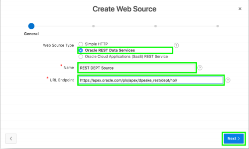
     
10. Base URLとService URL Pathを確認し、**Next**をクリックします。
11. **Discover**をクリックします。
*Authentication Required = No*
12. **Create Web Source**をクリックします。

    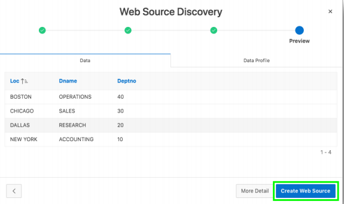

### **パート２**: DEPTを呼び出すファンクションを追加します。

1. メイン・メニューから、**SQL Workshop**を選択し、**SQL Scripts**をクリックします。 
    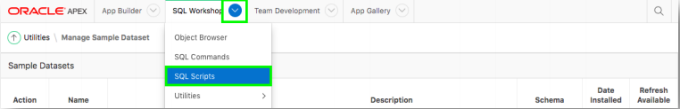

2. **Create**をクリックします。  
    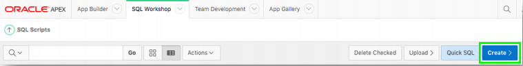

3. ブラウザで新しいウィンドウを開き、以下のURLにアクセスします: 
  http://www.oracle.com/technetwork/developer-tools/apex/application-express/apex-hol-func-5478627.txt

4. スクリプト・エディタにて:
    - Script Nameとして、**DEPT Function**を入力します。
    - 本文にファイルの内容をコピペします。
    - **Run**をクリックします。 
    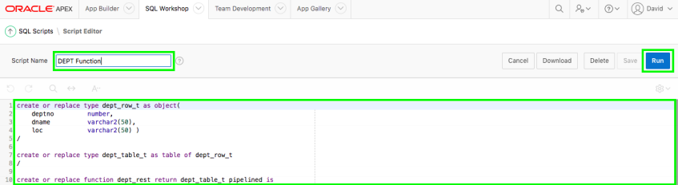

    - **Run Now**をクリックします。
    - ３行の実行が成功したというメッセージが結果として表示されます。
    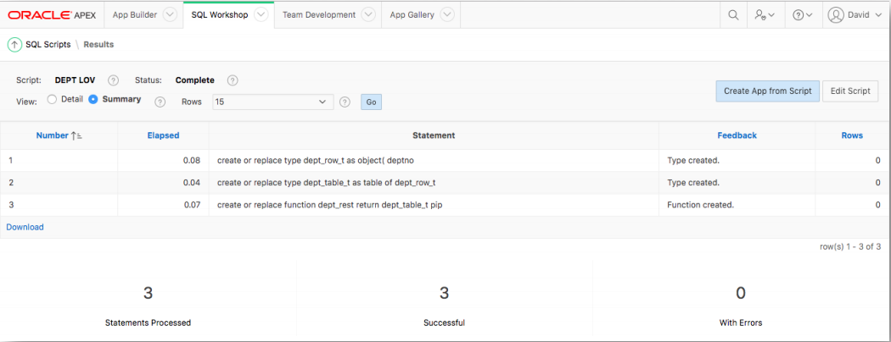

### **パート３**: LOVを追加します。

1. アプリケーション・ビルダーに戻り、開発中のアプリケーションを選択します。
2. **Shared Components**をクリックします; **List of Values**をクリックします。

    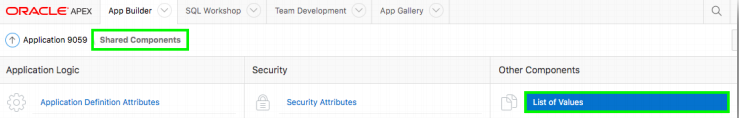

3. **Create**をクリックして、**Next**をクリックします。
*create list of valuesは、デフォルト: From Scratchのままにします。*
4. Nameとして、**DEPT LOV**を入力します。
5. Typeとして、**Dynamic**を選択します。
6. **Next**をクリックします。

    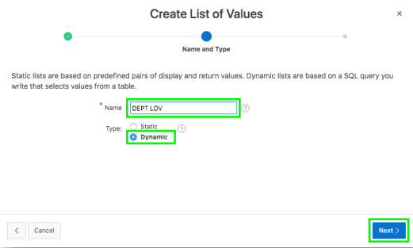

7. Queryとして以下を入力します。  
    ```
      select dname as d,
             deptno as r
        from table ( dept_rest )
      order by 1
    ```

    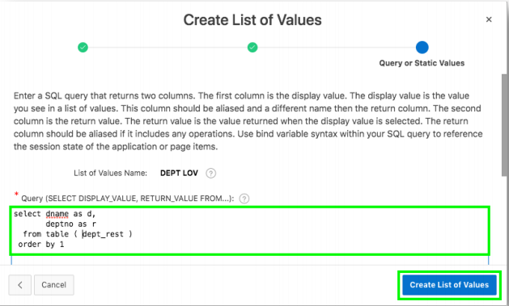  
    *注意: dept_restはパート２で作成したファンクションの名前です。*
    - **Create List of Values**をクリックします。

### **パート４**: EMPのページを更新します。

1. ブレットクラムに**Application xxxxx**として表示されているリンクをクリックし、そして、**2 - Employees**をクリックします。

    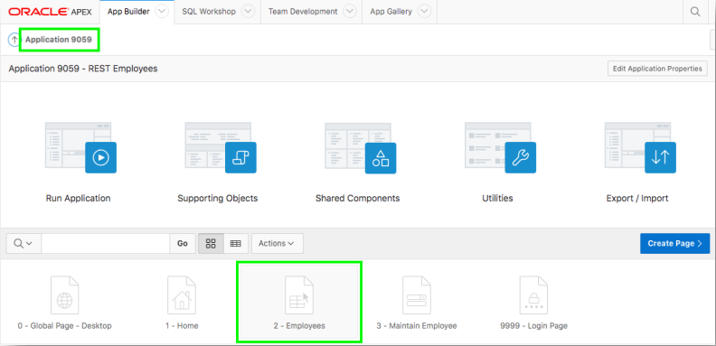


2. レンダリング・ツリー(左のペイン)にて、**Columns**をクリックし、それから**DEPTNO**をクリックします。  
    - プロパティ・エディタ (右のペイン)にて
        - Typeとして、**Plain Text (based on List of Values)**を選択します。
        - List of Valuesとして、**DEPT LOV**を選択します。
        - Heading > Alignmentとして、**Start**をクリックします。 
        - Layout > Column Alignmentとして、**Start**をクリックします。
    - ツール・バー上の、**Save**をクリックします。

    

3. ページの**3**へ移動します。

    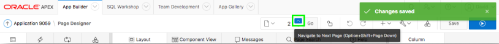
4. レンダリング・ツリー(左のペイン)にて、**P3_DEPTNO**をクリックします。
    - プロパティ・エディタ(右のペイン)にて
        - Typeとして、**Select List**を選択します。
        - List of Values > Typeとして、**Shared Component**を選択します。
        - List of Valuesとして、**DEPT LOV**を選択します。
        - Display Extra Valuesとして、**No**をクリックします。
        - Display Null Valueとして、**No**をクリックします
    - ツール・バーより、**Save**をクリックします。 

    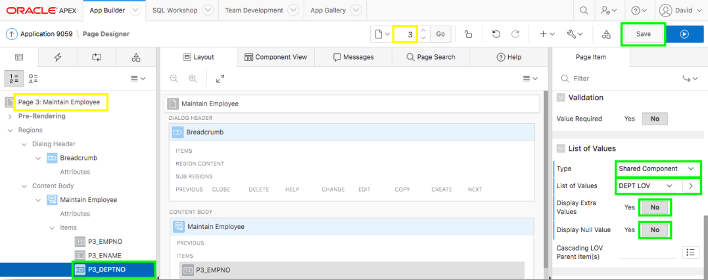

### **パート５**: アプリケーションを実行します。

1. 実行中のアプリケーションの画面に移動し、ブラウザをリフレッシュします。

    

2. 適当なレコードを選んで、編集アイコンをクリックします。そして、部署を選択します。

    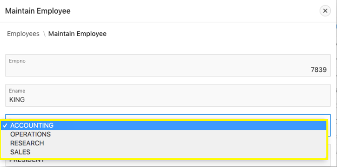

## まとめ

これで演習５の完了です。この演習では、RESTエンドポイントに紐付いたWebソース・モジュールによって、データの操作を行うアプリケーションを新規に作成する方法を学びました。

## **さらに学習を進める** - *役に立つリンク集*

- APEX on Autonomous https://apex.oracle.com/autonomous
- APEX Collateral https://apex.oracle.com
- Tutorials https://apex.oracle.com/en/learn/tutorials
- Community https://apex.oracle.com/community
- External Site + Slack http://apex.world