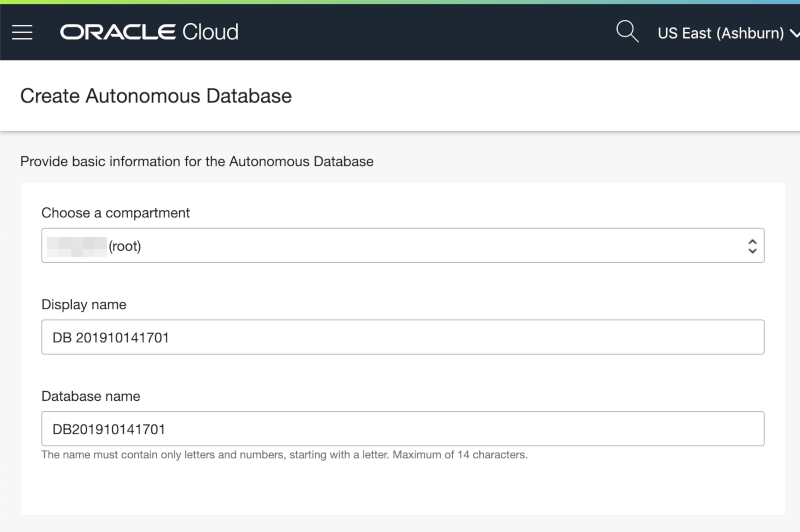
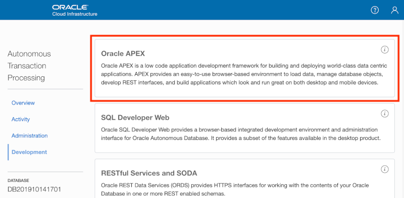
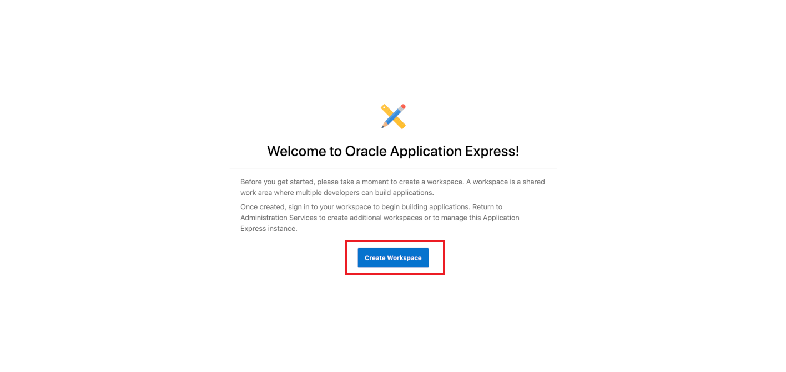
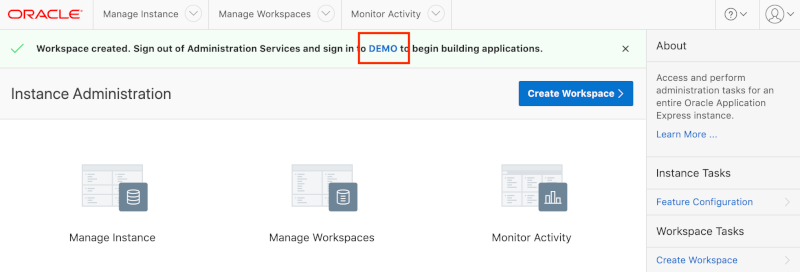

# Oracle Autonomous Cloud ServiceのRESTfulサービスを元にアプリケーションを作成します。

この演習では、異なるスキーマを２つ使用します。1つのAutonomous Databaseに、異なるデータベース・ユーザーに紐づいた２つのワークスペースを作成します。1番目のワークスペース（スキーマ）は、EMPとDEPT表を作成して、RESTインターフェースをそれらの表に作成するために使用します。2番目のワークスペースは、１番目のワークスペースに作ったRESTサービスを呼び出すWebソース・モジュールを定義するアプリケーションを作成するために使用します。

## 演習の目的

- 表にRESTモジュールを作成します。
- Webソース・モジュールを、新規に作成したアプリケーションに作成します。
- Webソース・モジュールを、使ったページを作成します。
- LOVを定義するファンクションを追加します。
## 演習の構成

| # | 演習 | 所用時間 |
| --- | --- | --- |
| 1 | [サンプル表の作成とRESTの有効化](1-building-your-rest-end-points-creating-a-sample-tables-and-rest-enabling.md) | 8 分 |
| 2 | [アプリケーションの作成](2-building-your-app-which-will-be-based-on-the-rest-endpoints-creating-the-app.md) | 5 分 |
| 3 | [EMP表へのWebソース・モジュールの追加](3-linking-the-rest-service-defined-in-the-first-workspace-adding-a-web-source-for-emp.md) | 8 分 |
| 4 | [ページの作成](4-defining-the-report-and-form-on-emp-creating-pages.md) | 12 分 |
| 5 | [LOVの定義](5-using-the-rest-service-on-dept-defining-list-of-values.md) | 10 分 |

## 演習の準備

### **パート１**: Oracle Cloudのトライアル・アカウントを取得します。

このパートでは、Oracle Cloudのトライアル・アカウントを取得します。すでにOracle Cloudのアカウントを取得済みの方は、パート２へ進んでください。

1.  ハンズオンの講師より、トライアル・アカウントを取得するサイトが提供されます。登録フォームに情報をすべて入力し登録を完了すると、$300ドルのクレジットと、いくつかの"永久無料"のサービスを含んだアカウントを受け取ることができます。今回は、このアカウントを使うことでにより、無料で演習を完了することができます。演習後も、余ったクレジットにより、引き続きOracle Cloudを使い続けることができます。"永久無料"のサービスについては、トライアル期間終了後も継続して使用可能です。

2.  トライアル・アカウントの取得を申請すると、すぐに次のようなメールを受け取ります。このメールを受け取ったら、パート２へ進んでください。

    

### **パート２**: Oracle Cloudへログインします。

このパートでは、Oracle Cloudが提供する色々なサービスを使用するために、Oracle Cloudアカウントにログインします。

1. 以下のメール **Get Started Now with Oracle Cloud**を受け取ったら、**Cloud Acccount Name**、**Username**それと**パスワード**は覚えておきます。パスワードはサインアップの際に指定したものになります。

2. 任意のブラウザから次のURLにアクセスします。https://www.oracle.com/cloud/sign-in.html.

3. あなたの **Cloud Account Name** を入力し、**Next**ボタンをクリックします。

    

4. あなたの **Username** と **Password**を入力し、 **Sign In**をクリックします。

    

### **パート３**: Autonomous Transaction Processingのインスタンスを作成します。

このバートでは、Autonomous Transaction Processingのインスタンスを作成します。

1. クラウド・ダッシュボードから、左上端のハンバーガー・メニューのアイコン をクリックし、開いたメニューの中から**Autonomous Transaction Processing**を選びます。

    

2. **Create Autonomous Databaseの作成**をクリックします。

    

3. **Always Free**オプションを選択し、**```SecretPassw0rd```**をADMINのパスワードとして設定したのち、 **Create Autonomous Database**をクリックします。(*ハンズオンだけに使うのであれば、パスワードはこのまま指定できます。*)

    
    
    

    **Create Autonomous Database**をクリックすると、新規に作成されるAutonomous Databaseの詳細を表示するページに移動します。インスタンスのステータスが使用可能になるのを待って、次のパートへ進んでください：

    
    
    こちらになる:

    

### **パート４**: 新規にAPEXのワークスペースを作成します。

APEXへの初回アクセス時には、新規にワークスペースを作成するためにAPEXインスタンスの管理者にてログインする必要があります。ワークスペースとは、APEXのアプリケーションを登録するための論理的な区画です。それぞれのワークスペースは表、ビュー、パッケージといったデータベース・オブジェクトを含む、一つ、もしくはそれ以上のデータベース・スキーマ（データベース・ユーザー）に紐づけられます。通常、APEXのアプリケーションは、これらのデータベース・オブジェクトを使って構築されます。

1. **Service Console**のボタンをクリックします。

    

2. 左にあるメニューの中の**Development**をクリックして、その後**Oracle APEX**をクリックします。 

    

3. 管理サービスのパスワードを入力し、 **Sign In to Administration** をクリックします。パスワードはATPのインスタンスを作成する際に指定したパスワード **```SecretPassw0rd```** と同じです。

    

4. **Create Workspace** をクリックします。

    

5. 詳細として以下を入力し **ワークスペースの作成** をクリックします。

    | 設定 | 値 |
    | --- | --- |
    | Database User | DEMO |
    | Password | **`SecretPassw0rd`** |
    | Workspace Name | DEMO |

    

6. 成功を通知するメッセージに含まれる**DEMO**のリンクをクリックします。このリンクをクリックすると、APEX管理からログアウトするので、新規に作成されたワークスペースにログインすることができるようになります。

    

7. パスワードとして**``SecretPassw0rd``**を入力し、**ワークスペースとユーザー名を記憶**のチェックボックスにチェックを入れて、**サインイン**をクリックします。

    
    
## まとめ

これで演習に必要な準備は完了です。このパートでは、新規にAutonomous Transaction Processingのインスタンスを作成する方法、および、そこにAPEXのワークスペースを作成する方法を学びました。[ここをクリックして、演習１へ進みます。](1-building-your-rest-end-points-creating-a-sample-tables-and-rest-enabling.md)
