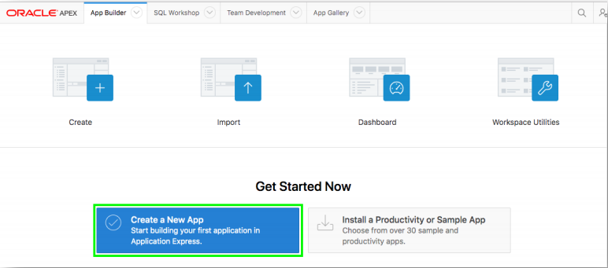
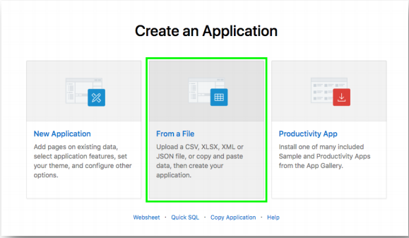
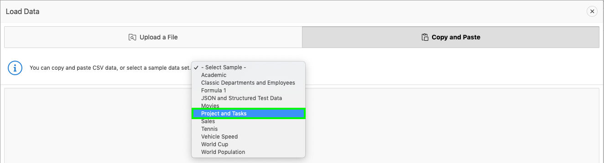
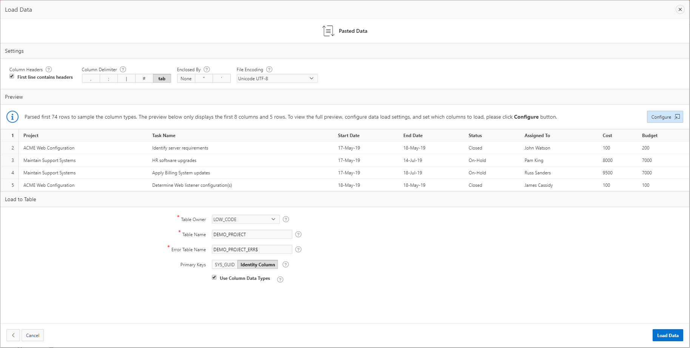
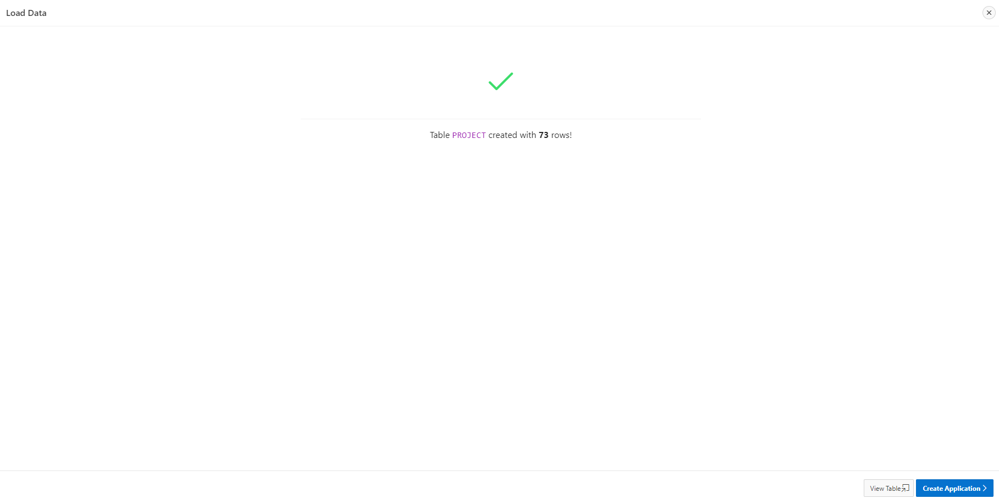
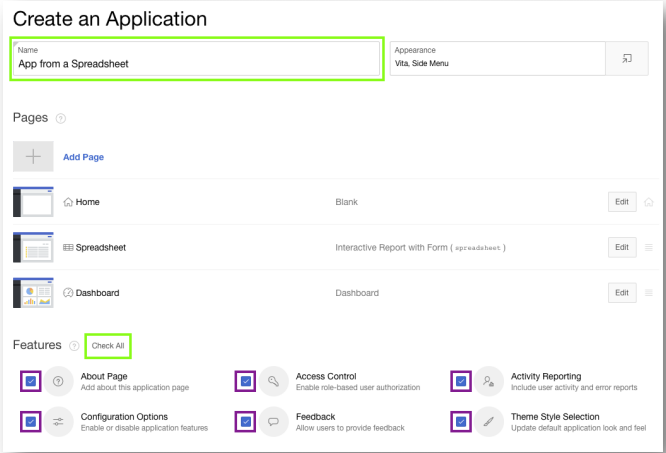
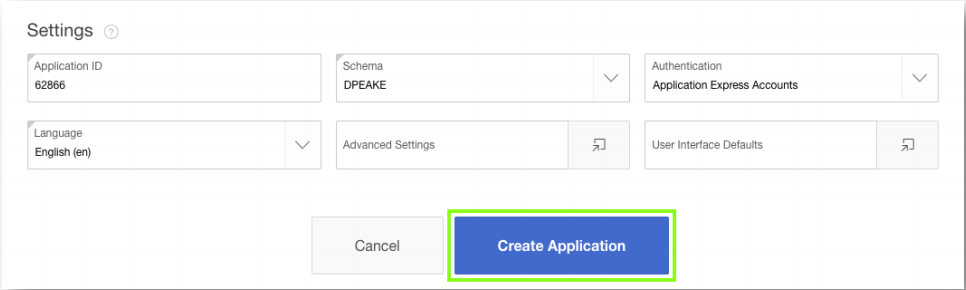
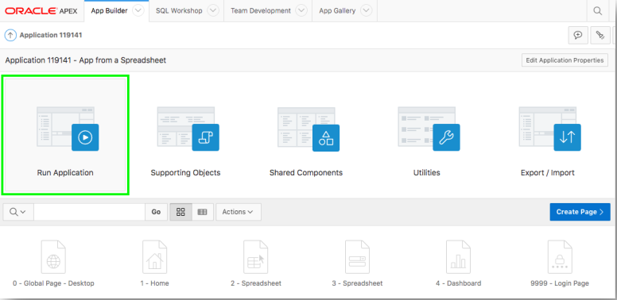
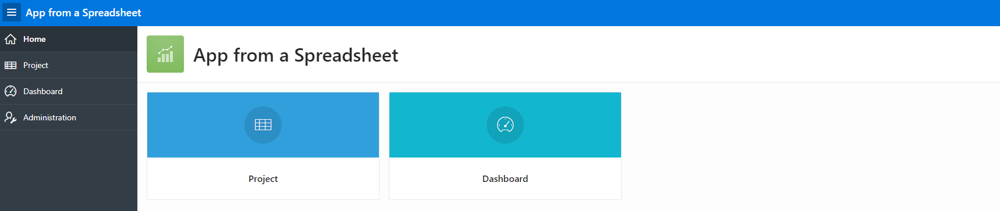

# 演習１: スプレッドシートを元にしたアプリケーション作成

この演習では、Excelで作成したスプレッドシートをデータベースにインポートした後、それを元にAPEXのアプリケーションを作成する方法を学びます。演習の準備を簡単にするため、APEX自体に含まれているサンプルのデータを使いますが、自分自身のスプレッドシートをアップロードしても手順は同じです。

### **パート１**: 「プロジェクトとタスク」のデータをロードします。  
 
1.  APEXワークスペースのホーム・ページより、**App Builder** をクリックします。
2.  **Create a New App** をクリックします。

    

3.  **From a File** をクリックします。

    

    アプリケーションをファイルから作成する場合、APEXではCSV、XLSX、XMLおよびJSON形式のファイルをアップロードできます。アプリケーションはそれらのファイルに含まれるデータから作成されます。それ以外に、CSVデータをコピー＆ペーストしたり、サンプル・データを元にすることができます。

4.  データのロードを行うウィザード画面の上部にある、**Copy and Paste** を選びます。そして、サンプル・データセットから **Project and Tasks**を選び、**Next** をクリックします。

    

5.  貼り付けられたデータを確認します。Table Nameとして **DEMO_PROJECT** を設定し、**Load Data** をクリックします。Error Table Nameは、Table Nameの末尾に \_ERR$ を付加した名前がデフォルトとして設定されることに注意してください。

    
    
    **Load Data** をクリックした後、データのロードが完了するまでスピナー(くるくる回るカーソル)が表示されます。完了したら、パート２へ進みます。

### **パート２**: アプリケーションを作成して実行します。 

データのロードを行うウィザードにより、新しく表が作成され、サンプルのデータがその表に投入されました。これから、この新しく作成された表を元に、アプリケーションを作成します。

1.  73行のデータが **DEMO_PROJECT** 表に投入されたことを確認します。その後、**Create Appllication** をクリックします。

    

2.  Nameに **スプレッドシート・アプリ** と入力し、Featuresの **Check All** をクリックして、チェックを入れます。その後、**Create Application** をクリックします。

    
    

    ウィザードによるアプリケーションの作成が完了すると、アプリケーション・ビルダーから、新たに作成されたアプリケーションのホーム・ページが開きます。

### **パート３**: 作成されたアプリケーションを実行します。

1.  **Run Application** をクリックします。そうすると、新たにブラウザのタブが開いて、そこでアプリケーションが実行されます。これにより、エンドユーザーから見えるアプリケーションの動作を確認できます。

    

2.  ログインのための情報を入力して、**Sign In**をクリックします。
3.  いくつかの操作をアプリケーションで行ってみましょう。ホーム・ページのメニューか、左にあるナビゲーション・メニューから **Project** をクリックすることで「レポート」ページを開き、サンプルのデータを参照します。そして、適当な行を選んで、編集アイコンをクリックし、詳細情報の表示と編集を行う「フォーム」ページを表示させます。次に、**Dashboard**ページに移動し、表示されるチャートを確認します。最後に、**Administration**ページにある、利用可能なオプションを確認します。

    

## まとめ

これで演習１は完了です。この演習では、ファイルのアップロードやデータのコピー＆ペーストを行い、サンプル・データをロードした上で、アプリケーションを作成する方法を学びました。また、作成したアプリケーションの簡単な操作も行いました。[ここをクリックして、演習２へ進みます](2-using-the-runtime-environment-improving-the-report-and-form.md)