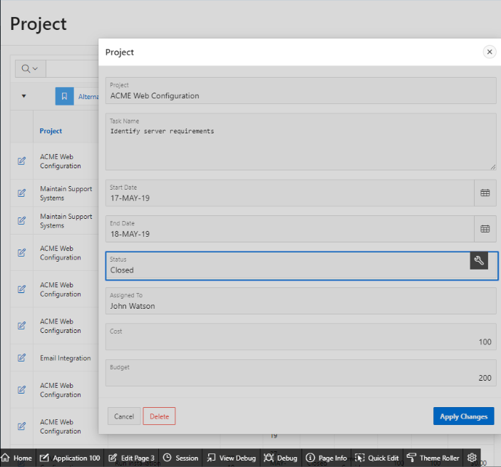

# 演習２: レポートとフォームの改良

この演習では、対話レポートやフォームのページを改良することで、アプリケーションの管理を実際に経験します。

### **パート１**: 対話レポートに基本的な改良を施します。

作成されたアプリケーションの対話レポートを、より見やすくなるように改良してみましょう。

1. アプリケーションが実行されていなければ、開発画面に移動し、**Run Application**をクリックし、アプリケーションを実行します。その後、**Project** をクリックします。
2. **Actions** をクリックして、**Data** を選択します。そして、**Sort**を選択します。
3. 1番目のソート対象として**Start Date**を選択します; 2番目のソート対象として**End Date**を選択します; その後**Apply**をクリックします。

    
    

4. レポートを保存するために、**Actions**をクリックし、**Report**を選択します。そして、**Save Report**を選択します。
5. Saveとして、**As Default Report Settings**を選択します。

    

6. Default Report Typeとして、**Alternative**を選択します; 名前に、**Date Review** を入力し、 **Apply** をクリックします。
  

    

### **パート２** - 対話レポートをさらに改良します。

このパートでは、計算から導き出された結果を新規のカラムとして追加することにより、さらに対話レポートを改良します。また、レポートのデータを確認できるように、チャートを作ります。
1. **Actions** をクリックして、**Data** を選択します。その後、**Compute** を選択します。
2. 以下のデータを入力して、**Apply.**をクリックします。
    | 設定 | 値 |
    | --- | --- |
    | Label | **Budget V Cost** |
    | Format Mask | **$5234.10** |
    | Computation Expression | **I - H** |

    
    これにより**Budget V Cost** と名付けられたカラムが新規に対話レポートに追加されます。

3. これから**Chart**を追加します。**Actions**をクリックし、**Chart**を選択します。
4. 以下のデータを入力して、**Apply**をクリックします。
    | 設定 | 値 |
    | --- | --- |
    | Label | **Project** |
    | Value | ****Budget V Cost** |
    | Function | **Sum** |
    | Sort | **Label-Ascending** |
    | Orientation | **Horizontal** |

    
    **Apply**をクリックすると、チャートを表示するボタンが表示され、レポートの表示とチャートの表示を切り替えることができるようになります。
    
5. レポートを保存するために**Save report**をクリックします。この演習のパート１にあるステップ４から６を繰り返します。
    
### **パート３** - フォームを改良します。

1. 実行されているアプリケーションの画面で、レポートを表示するアイコンをクリックします。
    
2. アプリケーションの画面で、任意のレコードにある編集アイコンをクリックします。
    
3. モーダル・ページが表示されます。
4. 開発者ツールバーにある、**Quick Edit**をクリックします。

    
5. **Status**アイテムの上にマウスを移動し(対象が青い枠で囲われるまで)、マウスをクリックします。
6. 編集対象のStatusアイテムにフォーカスが当たった状態で、ページ・デザイナが開きます。
7. ページ・デザイナのプロパティ・エディタ（右のペイン）にて、タイプとして**Select List**を選択します。
8. 下にあるLOVの設定に含まれるタイプとして、**SQL Query**を選択します。
9. SQL Queryの横にある**Code Editor**のアイコンをクリックします。

    

10. コード・エディタに以下を入力します:

    ```
    select distinct status d, status r
    from demo_project
    order by 1        
    ```

11. **Validate**をクリックして入力の書式を確認して、**OK**をクリックします。

    
  
12. Display Extra Valuesには**No**を指定します。
13. Null Value Displayには、**- Select Status -**を入力します。
14. **Save**をクリックします(ツール・バーの - 上部の右端)  
    
15. 実行中のアプリケーションの画面に移動しブラウザをリフレッシュします。編集アイコンをクリックした後、**Status**をクリックします。

    

## サマリ

これで演習２は完了です。この演習では、実行中のアプリケーションの画面の改良を行う方法と、ページ・デザイナを使用したフォームの改良方法を学びました。[ここをクリックして、演習３へ進みます](3-using-the-runtime-environment-adding-a-calendar.md)
