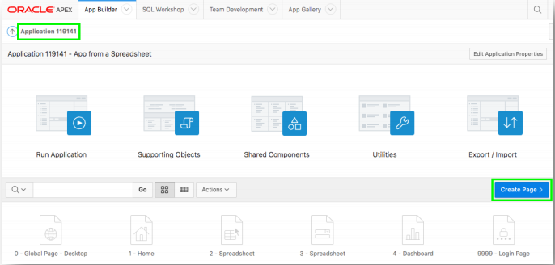
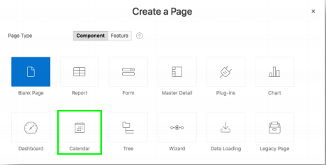
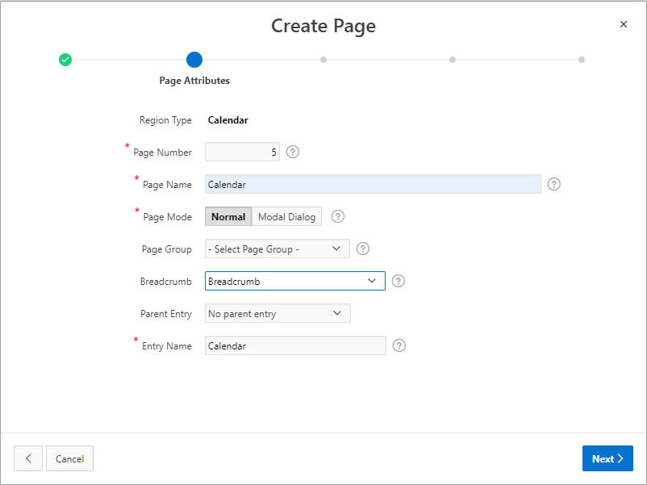
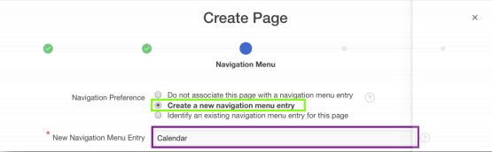
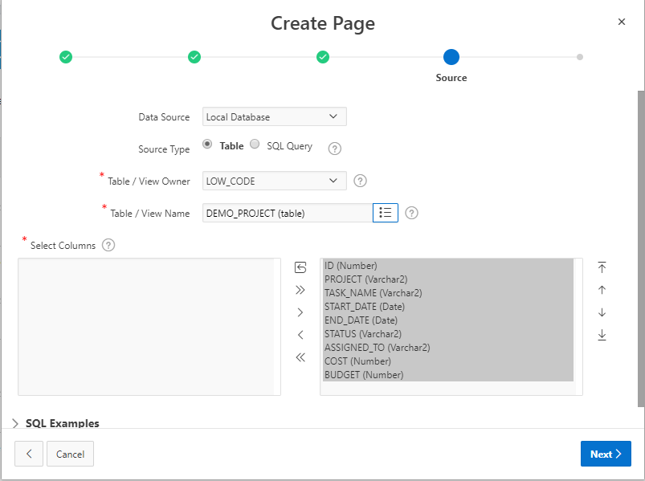
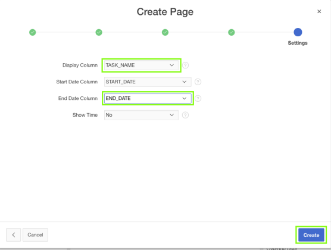
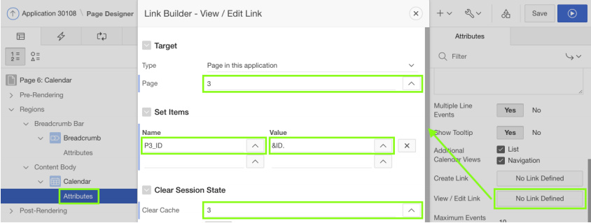
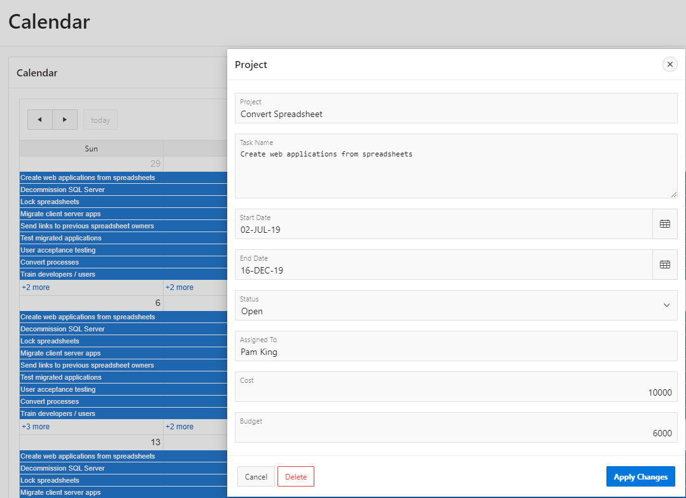

# 演習３: カレンダーを追加します。

この演習では、先ほど作成したアプリケーションに新規のページとしてカレンダを追加し、カレンダのデータをアップデートするフォームへのリンクを追加します。
### **パート１** - カレンダを追加します。

1. 開発環境へ移動します。アプリケーション・ビルダーにて、対象のアプリケーションのホーム・ページを開き、**Create Page**をクリックします。

    

2. **Calendar**をクリックします。
    

3. Page Nameとして、**Calendar**を入力します; Breadcrumbとして**Breadcrumb**を選択肢、**Next**をクリックします。  

    

4. Navigation Preferenceとして**Create a new navigation menu entry**をクリックし、**Next**をクリックします。 
     
5. Table / View Nameとして、**DEMO_PROJECT (table)**を選択して、**Next**をクリックします。  
    
6. Display Columnとして、**TASK_NAME**を選択します; End Date Columnとして、**END_DATE**を選択肢、**Create**をクリックします。  
    

### **パート２** – カレンダをクリックして、フォームを呼び出せるようにします。

1. レンダリング・タブのカレンダの下にある**Attributes**をクリックします。
2. プロパティ・エディタ（右のペイン）の、**View / Edit Link**をクリックします。
3. Pageとして、**3**を選択します。
4. Set Itemsについて – Nameとして**P3_ID**を選択します; Valueとして**ID**を選択します。
5. Clear Cacheとして、**3**を入力します。
6. **OK**をクリックします。その後、**Save and Run**をクリックします。

    

      
    *注意: ５月のカレンダを開かないと、入力済みのエントリが表示されません。*

## まとめ

これで演習３は完了です。今までの演習から、ファイルをアップロードしてアプリケーションを作成する方法、アプリケーションの実行環境とページ・デザイナを使ってページを改良する方法、さらに、ページを追加することでアプリケーションを改良する方法を学びました。

## **さらに学習を進める** - *役に立つリンク集*

- APEX on Autonomous  https://apex.oracle.com/autonomous
- APEX Collateral  http://apex.oracle.com
- Tutorials  https://apex.oracle.com/en/learn/tutorials
- Community  http://apex.oracle.com/community
- External Site + Slack  http://apex.world
