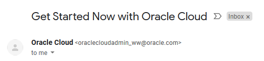
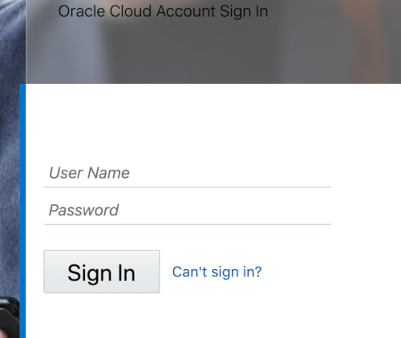
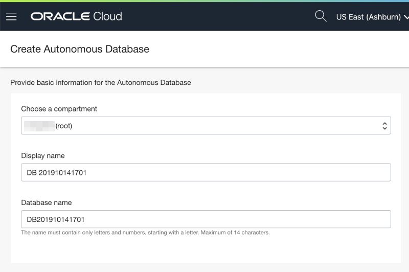
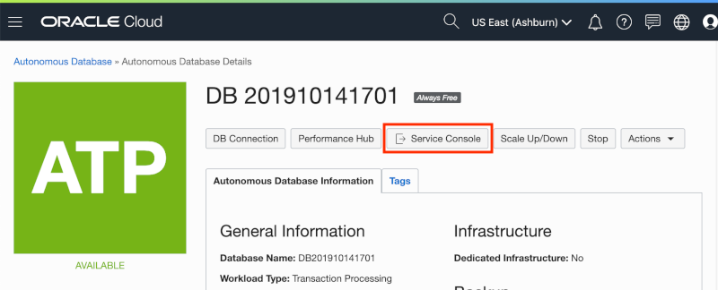
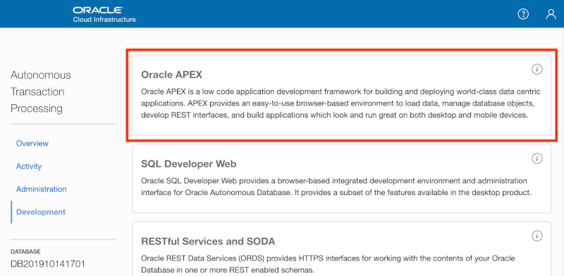
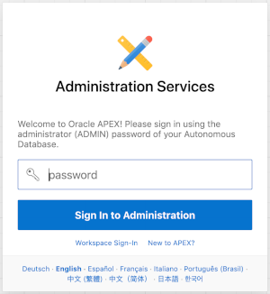
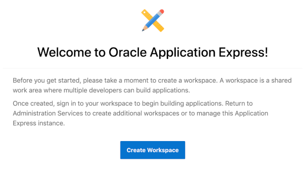
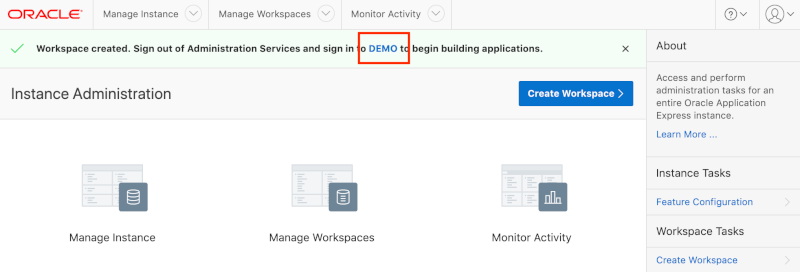
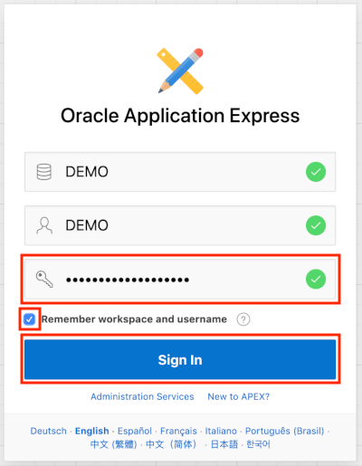

# スプレッドシートを元にアプリケーションを作成します。

この演習では、最初にオラクル・データベースにスプレッドシートをアップロードすることで、新規に表を作成します。そして、その表を元にアプリケーションを生成します。その後、生成されたアプリケーションに含まれる、対話レポートとフォームの使い方を学びます。最後に、カレンダーのページを追加し、すでにあるフォームとの関連付けを行います。

これからは、メールでスプレッドシートを回覧して情報を集めるより、短い時間でアプリケーションを作成し、そのURLをメールで配布する方がとても簡単であることが分かるでしょう。作成されたアプリケーションにより、安全で、拡張が容易で、データの重複がない、複数のユーザーが同時にデータの参照と更新ができるようになります。

## 演習の目的

* ワークスペースを取得します。
* スプレッドシートをアップロードし、アプリケーションを作成します。
* 対話レポートの使い方を学びます。
* カレンダーを追加します。

## 演習の構成

| # | 演習 | 所要時間 |
| --- | --- | --- |
| 1 | [スプレッドシートを元にしたアプリケーション作成](1-building-your-first-app-creating-an-app-from-a-spreadsheet.md) | 4分 |
| 2 | [レポートとフォームの改良](2-using-the-runtime-environment-improving-the-report-and-form.md) | 10分 |
| 3 | [カレンダーの追加](3-using-the-runtime-environment-adding-a-calendar.md) | 5分 |

## 演習の準備

### **パート１**: Oracle Cloudのトライアル・アカウントを取得します。

このパートでは、Oracle Cloudのトライアル・アカウントを取得します。すでにOracle Cloudのアカウントを取得済みの方は、パート２へ進んでください。

1.  ハンズオンの講師より、トライアル・アカウントを取得するサイトが提供されます。登録フォームに情報をすべて入力し登録を完了すると、$300ドルのクレジットと、いくつかの"永久無料"のサービスを含んだアカウントを受け取ることができます。今回は、このアカウントを使うことでにより、無料で演習を完了することができます。演習後も、余ったクレジットにより、引き続きOracle Cloudを使い続けることができます。"永久無料"のサービスについては、トライアル期間終了後も継続して使用可能です。

2.  トライアル・アカウントの取得を申請すると、すぐに次のようなメールを受け取ります。このメールを受け取ったら、パート２へ進んでください。

    

### **パート２**: Oracle Cloudへログインします。

このパートでは、Oracle Cloudが提供する色々なサービスを使用するために、Oracle Cloudアカウントにログインします。

1. 以下のメール **Get Started Now with Oracle Cloud** を受け取ったら、**Cloud Acccount Name**、**Username** それとパスワードは覚えておきます。パスワードはサインアップの際に指定したものになります。

2. 任意のブラウザから次のURLにアクセスします。https://www.oracle.com/cloud/sign-in.html.

3. あなたの **Cloud Account Name** を入力し、**Next**ボタンをクリックします。

    

4. あなたの **Username** と **Password** を入力し、 **Sign In**をクリックします。

    

### **パート３**: Autonomous Transaction Processingのインスタンスを作成します。

このバートでは、Autonomous Transaction Processingのインスタンスを作成します。

1. クラウド・ダッシュボードから、左上端のハンバーガー・メニューのアイコン をクリックし、開いたメニューの中から**Autonomous Transaction Processing**を選びます。

    

2. **Create Autonomous Databaseの作成**をクリックします。

    

3. **Always Free**オプションを選択し、**```SecretPassw0rd```** をADMINのパスワードとして設定したのち、 **Autonomous Databaseの作成** をクリックします。(*ハンズオンだけに使うのであれば、パスワードはこのまま指定できます。*)

    
    
    

    **Autonomous Databaseの作成** をクリックすると、新規に作成されるAutonomous Databaseの詳細を表示するページに移動します。インスタンスのステータスが使用可能になるのを待って、次のパートへ進んでください：
    
    
    
    こちらになる:

    

### **パート４**: 新規にAPEXのワークスペースを作成します。

APEXへの初回アクセス時には、新規にワークスペースを作成するためにAPEXインスタンスの管理者にてログインする必要があります。ワークスペースとは、APEXのアプリケーションを登録するための論理的な区画です。それぞれのワークスペースは表、ビュー、パッケージといったデータベース・オブジェクトを含む、一つ、もしくはそれ以上のデータベース・スキーマ（データベース・ユーザー）に紐づけられます。通常、APEXのアプリケーションは、これらのデータベース・オブジェクトを使って構築されます。

1. **サービス・コンソール** のボタンをクリックします。

    

2. 左にあるメニューの中の **Development** をクリックして, その後 **Oracle APEX** をクリックします。 

    

3. 管理サービスのパスワードを入力し、 **管理にサインイン** をクリックします。パスワードはATPのインスタンスを作成する際に指定したパスワード **```SecretPassw0rd```** と同じです。

    

4. **ワークスペースの作成** をクリックします。

    

5. 詳細として以下を入力し **ワークスペースの作成** をクリックします。

    | 入力する対象 | 入力する値 |
    | --- | --- |
    | データベース・ユーザー | DEMO |
    | パスワード | **`SecretPassw0rd`** |
    | ワークスペース名 | DEMO |

    

6. 成功を通知するメッセージに含まれる**DEMO**のリンクをクリックします。このリンクをクリックすると、APEX管理からログアウトするので、新規に作成されたワークスペースにログインすることができるようになります。

    

7. パスワードとして**``SecretPassw0rd``** を入力し、**ワークスペースとユーザー名を記憶**のチェックボックスにチェックを入れて、**サインイン** をクリックします。

    
    
## まとめ

これで演習に必要な準備は完了です。このパートでは、新規にAutonomous Transaction Processingのインスタンスを作成する方法、および、そこにAPEXのワークスペースを作成する方法を学びました。[ここをクリックして、演習１へ進みます](1-building-your-first-app-creating-an-app-from-a-spreadsheet.md)